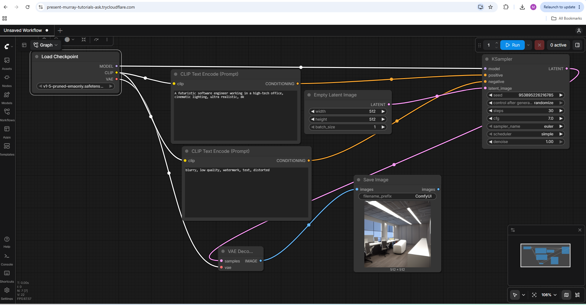

# Stable Diffusion 1.5 Deployment and Image Generation using ComfyUI on Kaggle

## Overview

This project demonstrates the deployment and usage of Stable Diffusion 1.5 using ComfyUI on Kaggle's free Tesla T4 GPUs.

The primary objective was to understand the complete image generation workflow, from model deployment and GPU utilization to prompt-based image generation through a browser-accessible interface.

Instead of relying on paid AI image generation platforms, this setup allows Stable Diffusion to run on free cloud infrastructure provided by Kaggle.

---

## Problem Statement

Modern AI image generation models require significant computational resources, especially GPUs, which are often unavailable on entry-level personal computers.

The challenge is to run an open-source image generation model without investing in expensive hardware while still maintaining full control over the generation pipeline.

This project addresses that challenge by combining:

- Kaggle's free GPU resources
- Stable Diffusion 1.5
- ComfyUI
- Cloudflare Tunnel

to create a browser-accessible AI image generation environment.

---

## Why Stable Diffusion?

Stable Diffusion is one of the most popular open-source text-to-image models.

### Benefits

- Free and open source
- Unlimited image generation
- Complete control over generation parameters
- Supports local and cloud deployment
- No subscription costs
- Large and active ecosystem
- Extensive community support

---

## Why Kaggle?

Running Stable Diffusion effectively requires GPU acceleration.

Instead of using local hardware, Kaggle provides:

- Tesla T4 GPUs
- Cloud storage
- Managed notebook environments
- Internet access
- Free experimentation environment

This makes it possible to explore AI image generation without investing in expensive hardware.

---

## Project Architecture

```text
User Browser
      │
      ▼
Cloudflare Tunnel
      │
      ▼
Kaggle Notebook Environment
      │
      ▼
ComfyUI
      │
      ▼
Stable Diffusion 1.5 Model
      │
      ▼
Tesla T4 GPU
      │
      ▼
Generated Image
```

---

## Technologies Used

- Python
- Stable Diffusion 1.5
- ComfyUI
- Kaggle Notebooks
- Tesla T4 GPU
- Cloudflare Tunnel
- Hugging Face Model Hub

---

## Project Setup

### 1. Clone ComfyUI

```bash
git clone https://github.com/comfyanonymous/ComfyUI.git
cd ComfyUI
```

### 2. Install Dependencies

```bash
pip install -r requirements.txt
```

### 3. Download Stable Diffusion Model

```bash
mkdir -p models/checkpoints

wget -O models/checkpoints/v1-5-pruned-emaonly.safetensors \
https://huggingface.co/stable-diffusion-v1-5/stable-diffusion-v1-5/resolve/main/v1-5-pruned-emaonly.safetensors
```

### 4. Launch ComfyUI

```python
import subprocess
import threading

def run():
    subprocess.run([
        "python",
        "main.py",
        "--listen",
        "0.0.0.0",
        "--port",
        "8188"
    ])

threading.Thread(target=run, daemon=True).start()
```

### 5. Download Cloudflare Tunnel

```bash
wget -q https://github.com/cloudflare/cloudflared/releases/latest/download/cloudflared-linux-amd64
chmod +x cloudflared-linux-amd64
```

### 6. Expose ComfyUI to the Browser

```bash
./cloudflared-linux-amd64 tunnel --url http://localhost:8188 --no-autoupdate
```

The generated Cloudflare URL provides public browser access to the locally running ComfyUI instance.

---

## Understanding the Workflow

The image generation pipeline consists of the following key nodes:

### 1. Load Checkpoint

Loads the Stable Diffusion model into memory.

**Model Used**

```text
v1-5-pruned-emaonly.safetensors
```

---

### 2. CLIP Text Encode

Converts human-readable prompts into numerical embeddings that the model can understand.

Used for:

- Positive prompts
- Negative prompts

---

### 3. Empty Latent Image

Creates an initial latent representation (noise) that serves as the starting point for image generation.

---

### 4. KSampler

The core generation engine responsible for:

- Denoising
- Sampling
- Image synthesis
- Prompt-guided generation

This is where the model transforms noise into meaningful visual content.

---

### 5. VAE Decode

Converts latent representations into actual images that can be viewed and saved.

---

### 6. Save Image

Stores the generated output in the configured output directory.

---

## Workflow Diagram

```text
Load Checkpoint
        │
        ▼
CLIP Text Encode
        │
        ▼
Empty Latent Image
        │
        ▼
KSampler
        │
        ▼
VAE Decode
        │
        ▼
Save Image
```

---

## Generation Workflow

```text
Text Prompt
      │
      ▼
CLIP Text Encoding
      │
      ▼
Stable Diffusion Model
      │
      ▼
Latent Noise Generation
      │
      ▼
KSampler Denoising Process
      │
      ▼
VAE Decoding
      │
      ▼
Generated Image
```

---

## Sample Prompt

### Positive Prompt

```text
A futuristic Hyderabad skyline at sunset, ultra realistic,
cinematic lighting, highly detailed, 8k
```

### Negative Prompt

```text
blurry, low quality, watermark, distorted
```

---

## Results

Successfully deployed Stable Diffusion 1.5 using ComfyUI on Kaggle's Tesla T4 GPUs and generated images through a browser-accessible interface.

### Generation Configuration

- Model: Stable Diffusion 1.5
- Resolution: 512 × 512
- Steps: 30
- CFG Scale: 7
- Sampler: Euler

### Observed Performance

- Image generation time: ~9 seconds
- Hardware: Tesla T4 GPU
- Environment: Kaggle Notebook

---

## Generated Output

Images are stored in:

```text
ComfyUI/output
```

Example output:

```text
ComfyUI_00001_.png
```

---

## Screenshots

### Workflow



### Generated Image


---

## Key Learnings

Through this project, I gained practical exposure to:

- Stable Diffusion architecture
- Generative AI image pipelines
- GPU-based AI inference
- ComfyUI node-based workflows
- Prompt engineering
- Cloud-based deployment environments
- Cloudflare Tunnel integration
- Model deployment and inference workflows
- AI image generation using text prompts

---

## Challenges Faced

During implementation, the originally referenced Stable Diffusion repository used in the learning material was unavailable. To overcome this, the deployment approach was adapted by:

- Switching from Automatic1111 to ComfyUI
- Using Cloudflare Tunnel instead of Ngrok
- Manually downloading and configuring Stable Diffusion 1.5
- Creating a custom image generation workflow

This provided a deeper understanding of the underlying deployment process.

---

## Future Improvements

Potential enhancements include:

- Stable Diffusion XL (SDXL)
- FLUX Models
- ControlNet Integration
- LoRA Training
- Image-to-Image Generation
- Inpainting Workflows
- AI Logo Generation
- Character Generation Pipelines
- Custom Model Fine-Tuning
- API-Based Deployment

---

## Repository Structure

```text
stable-diffusion-comfyui-kaggle/
│
├── README.md
│
└── screenshots/
    ├── workflow.png
    └── generated_output.png
```

---

## Disclaimer

This repository is intended for educational and learning purposes to understand modern AI image generation systems, deployment workflows, and cloud-based GPU environments.

The Stable Diffusion model and ComfyUI framework belong to their respective creators and maintainers.
